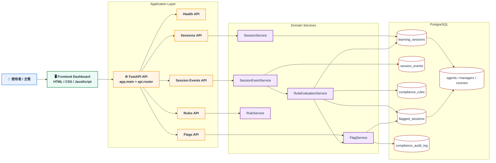

# Anti-Gaming 合規風險監控 Web App

## 專案摘要
本專案是一套針對企業微學習平台設計的反作弊與合規稽核系統，目標是辨識「形式上完成課程，但實際上沒有正常學習」的風險行為，並提供主管可追溯的審核流程。

本系統聚焦於金融與保險培訓場景，將學習行為轉換成可被信任、可被查核的數位證據。

## 問題背景
當課程完成紀錄與績效、獎金、證照或法規遵循掛鉤時，使用者可能透過下列方式快速通關：
- 快速滑過課程內容
- 盲猜或略過測驗
- 頻繁切換頁籤或 App

若企業無法證明培訓過程可信，後續面對內控或主管機關檢查時，教育訓練紀錄的說服力會不足。

## 解決方案
本專案以 `session events + rule engine + supervisor review + audit trail` 建立完整閉環：

1. 蒐集學習行為事件
2. 用規則引擎判斷是否異常
3. 將異常寫入 Risk Inbox
4. 由主管查看 Timeline 並做審核
5. 將所有處理行為寫入 audit log

## 核心功能

### Risk Inbox
- 顯示所有被標記的異常事件
- 支援風險等級、處理狀態、關鍵字篩選
- 協助主管優先處理待審案件

### Flag Detail
- 顯示命中規則、風險原因與 session 指標
- 包含完成秒數、測驗秒數、測驗分數、切換次數、滑卡數

### Forensic Timeline
- 重建單筆 session 的事件軌跡
- 顯示開始、滑卡、答題、切頁、完成等操作順序

### Resolution Action Bar
- 支援 `approved`、`voided`、`escalated_to_hr`
- 要求主管輸入說明
- 同步更新狀態與 session 鎖定資訊

### Audit Trail
- 保留主管處理紀錄
- 可作為後續查核與內控留痕依據

### Demo Scenarios
- 前端支援一鍵模擬三種典型案例
- 可快速展示規則判斷與畫面刷新流程

## 技術架構
- 前端：`HTML + CSS + JavaScript`
- 後端：`Python FastAPI`
- 資料庫：`PostgreSQL`

## 目前已完成的規則
- `IMPOSSIBLE_SPEED`
  完成時間低於課程平均時間門檻
- `BLIND_GUESSING`
  短時間完成測驗且得分為指定低分
- `EXCESSIVE_CONTEXT_SWITCH`
  學習期間切換頁籤或 App 次數過高

## 資料模型
- `compliance_rules`
  儲存規則定義、參數與風險等級
- `learning_sessions`
  儲存單次學習 session 的摘要指標
- `session_events`
  儲存事件明細
- `flagged_sessions`
  儲存被規則引擎標記的異常事件
- `compliance_audit_log`
  儲存主管審核紀錄

## API 範圍
- `GET /health`
- `GET /api/v1/rules`
- `POST /api/v1/sessions`
- `POST /api/v1/session-events`
- `GET /api/v1/flags`
- `GET /api/v1/flags/{flag_id}`
- `POST /api/v1/flags/{flag_id}/resolution`

## 架構圖


## 風險判斷流程
```mermaid
sequenceDiagram
    %% ===== Participants =====
    participant U as 👤 學員 / Demo
    participant FE as 🖥️ Frontend Dashboard
    participant SA as ⚙️ Sessions API
    participant EA as ⚙️ Events API
    participant RE as 🧠 Rule Engine
    participant DB as 🗄️ PostgreSQL
    participant M as 👨‍💼 主管

    %% ===== User Flow =====
    U->>FE: 開始課程 / 作答 / 切換頁籤
    FE->>SA: 建立 Session<br/>POST /sessions
    SA->>DB: 寫入 learning_sessions
    DB-->>SA: 回傳 session_id

    %% ===== Event Streaming =====
    loop 🔁 行為持續上報
        FE->>EA: 上報事件<br/>POST /session-events
        EA->>DB: 寫入 session_events

        %% Rule Evaluation
        EA->>RE: evaluate(session_id)
        RE->>DB: 讀取 Session + Rules
        RE->>RE: ⚡ 異常行為判斷

        alt 🚨 命中風險規則
            RE->>DB: 寫入 flagged_sessions
            RE->>DB: 更新 Session 狀態（鎖定 / 扣分）
        else ✅ 正常行為
            RE-->>EA: 通過
        end
    end

    %% ===== Manager Flow =====
    M->>FE: 查看 Risk Inbox / Timeline / Detail
    FE->>DB: 查詢 flagged_sessions

    M->>FE: 審核決策<br/>(approve / void / escalate)
    FE->>DB: 寫入 compliance_audit_log
## 目前完成狀態
- backend 與 database 已可在本機啟動
- `schema.sql` 已可匯入 PostgreSQL
- seed data 已可建立固定 demo 案例
- FastAPI `/health` 已可回傳 `status: ok`、`database: ok`
- `flags` API 已可回傳 demo 資料s
- 已完成一輪端到端 API 驗證：
  - 建立 session
  - 寫入 events
  - 觸發 flag
  - 完成 resolution
  - 寫入 audit log
```

## 一句話總結
這不是單純的學習平台功能，而是一套把學習行為轉成可監管、可審核、可追溯數位證據的合規風險控管系統。
