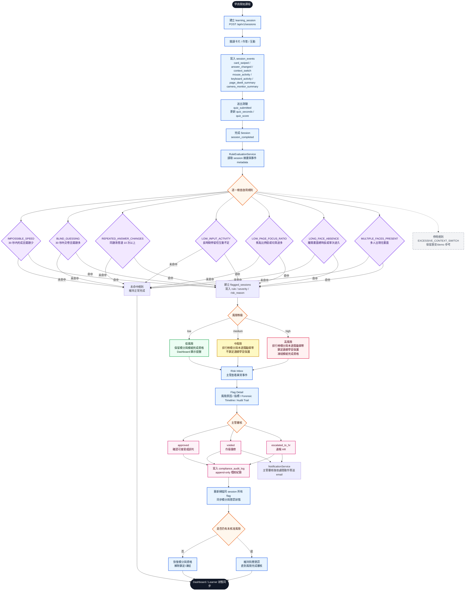

# 系統架構圖與風險判斷流程圖

本文件整理目前 Anti-Gaming 合規風險監控 Web App 的系統架構與風險判斷流程。圖中的流程以目前實作為準：包含 email 通知與鏡頭 presence 偵測；前端會優先使用原生 `FaceDetector`，不支援時改用 MediaPipe Face Detector fallback。

## 2026-04-21 更新紀錄
- Learner Simulator 新增鏡頭 presence 偵測，送出 `camera_monitor_summary`。
- RuleEvaluationService 重新啟用 `LONG_FACE_ABSENCE` 與 `MULTIPLE_FACES_PRESENT`。
- NotificationService 只會在主管審核後依處理動作寄送 email：`voided` 通知重修，`escalated_to_hr` 通知 HR，`approved` 不寄信。
- Gmail SMTP 已以 Google app password 完成實寄驗證；後端會移除 app password 空白後登入。

## 系統架構圖

```mermaid
flowchart LR
  learner["學員測驗平台<br/>learner.html"]
  dashboard["合規風險監控儀表板<br/>index.html"]

  subgraph frontend["Frontend<br/>HTML / CSS / JavaScript"]
    learner
    dashboard
  end

  subgraph api["Backend API<br/>FastAPI"]
    health["Health API<br/>/health"]
    sessions["Session API<br/>/api/v1/sessions"]
    events["Session Events API<br/>/api/v1/session-events"]
    rules["Rules API<br/>/api/v1/rules"]
    flags["Flags API<br/>/api/v1/flags"]
    resolution["Resolution API<br/>/api/v1/flags/{flag_id}/resolution"]
  end

  subgraph services["Backend Services"]
    sessionService["SessionService<br/>建立 Session / 近期紀錄 / 排行榜"]
    eventService["SessionEventService<br/>事件驗證 / 寫入 / 摘要同步"]
    ruleService["RuleEvaluationService<br/>規則判斷 / 風險等級 / 懲罰計算"]
    notificationService["NotificationService<br/>SMTP email 通知"]
    flagService["FlagService<br/>Risk Inbox / Flag Detail / 審核 / Audit Trail"]
  end

  subgraph db["PostgreSQL Database"]
    agents[("agents<br/>業務員")]
    managers[("managers<br/>審核主管")]
    courses[("courses<br/>課程")]
    learningSessions[("learning_sessions<br/>學習 Session 摘要")]
    sessionEvents[("session_events<br/>學習事件明細")]
    complianceRules[("compliance_rules<br/>規則定義與參數")]
    flaggedSessions[("flagged_sessions<br/>風險收件匣")]
    auditLog[("compliance_audit_log<br/>不可變動稽核紀錄")]
  end

  learner -->|"建立學習紀錄"| sessions
  learner -->|"送出學習事件"| events
  learner -->|"鏡頭 presence 統計"| events
  learner -->|"同步積分與懲罰狀態"| sessions

  dashboard -->|"讀取規則與懲罰說明"| rules
  dashboard -->|"查看近期 Session / Leaderboard"| sessions
  dashboard -->|"查看 Risk Inbox / Flag Detail"| flags
  dashboard -->|"送出主管審核"| resolution

  sessions --> sessionService
  events --> eventService
  rules --> complianceRules
  flags --> flagService
  resolution --> flagService
  health --> db

  sessionService --> agents
  sessionService --> courses
  sessionService --> learningSessions
  sessionService --> sessionEvents
  sessionService --> flaggedSessions

  eventService --> learningSessions
  eventService --> sessionEvents
  eventService --> ruleService

  ruleService --> complianceRules
  ruleService --> sessionEvents
  ruleService --> learningSessions
  ruleService --> flaggedSessions
  flagService --> flaggedSessions
  flagService --> learningSessions
  flagService --> sessionEvents
  flagService --> complianceRules
  flagService --> managers
  flagService --> auditLog
  flagService --> notificationService

  classDef ui fill:#F8F1E7,stroke:#B7791F,stroke-width:2px,color:#2D2416;
  classDef api fill:#E8F4FF,stroke:#2563EB,stroke-width:2px,color:#102A43;
  classDef service fill:#ECFDF3,stroke:#16A34A,stroke-width:2px,color:#123524;
  classDef data fill:#F2E8FF,stroke:#7C3AED,stroke-width:2px,color:#2E1065;
  classDef audit fill:#FFF1F2,stroke:#E11D48,stroke-width:2px,color:#4C0519;

  class learner,dashboard ui;
  class health,sessions,events,rules,flags,resolution api;
  class sessionService,eventService,ruleService,notificationService,flagService service;
  class agents,managers,courses,learningSessions,sessionEvents,complianceRules,flaggedSessions data;
  class auditLog audit;
```

## 風險判斷流程圖

## 圖例

| 顏色 | 代表 |
| --- | --- |
| 米色 | 前端頁面 |
| 藍色 | API endpoint |
| 綠色 | Backend service |
| 紫色 | PostgreSQL 資料表或規則判斷 |
| 紅色 | 高風險、稽核或不可變動紀錄 |
| 灰色虛線 | 已停用或不進入目前主流程 |
