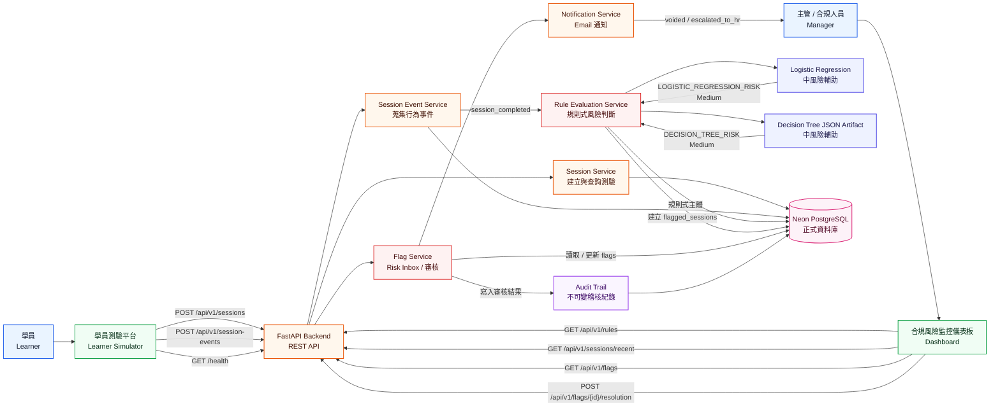

# Anti-Gaming 系統架構圖與風險判斷流程圖

本文件依照目前專案實作重新整理整體系統視圖，內容已對齊 `frontend/`、`backend/`、`schema.sql`、`docker-compose.yml` 與各 service 的實際程式流程。這一版不是只有元件清單，而是把「資料怎麼流動」、「風險怎麼形成」、「主管審核後怎麼回寫」都畫進去，適合直接放進簡報、技術文件或 Demo 附錄。

## 專案掃描摘要

### Frontend
- `frontend/learner.html` + `frontend/learner.js`
  - 建立學習 session
  - 蒐集卡片瀏覽、改答、測驗、頁面焦點、鍵鼠活動
  - 啟用鏡頭 presence 偵測
  - 原生 `FaceDetector` 不可用時 fallback 到 MediaPipe
- `frontend/index.html` + `frontend/app.js`
  - 顯示 Risk Inbox、Flag Detail、Timeline、Audit Trail
  - 查詢 recent sessions、leaderboard、rules
  - 送出主管 resolution

### Backend
- `FastAPI` API 層負責接前端請求
- `SessionService` 管理 session 建立、recent sessions、leaderboard、session detail
- `SessionEventService` 驗證事件、寫入 `session_events`、於 `session_completed` 後觸發規則判斷
- `RuleEvaluationService` 根據 session 摘要與事件 metadata 評估 active rules，並呼叫 ML 輔助評分
- `ML helpers` 提供邏輯回歸形式輔助評分與決策樹 JSON artifact 推論
- `FlagService` 查詢風險事件、組裝明細、寫入主管審核與同步懲罰
- `NotificationService` 在 `voided` / `escalated_to_hr` 後寄出 email

### Database
- PostgreSQL 為核心資料來源
- 主要表：`agents`、`managers`、`courses`、`learning_sessions`、`session_events`、`compliance_rules`、`flagged_sessions`、`compliance_audit_log`
- `compliance_audit_log` 具 append-only trigger，禁止 `UPDATE` / `DELETE` / `TRUNCATE`

### 部署與執行
- 正式環境目前為 `Vercel + Neon PostgreSQL`
- `FastAPI` 在 production 會同時提供 API 與 `frontend/` 靜態頁面
- 本地開發可用 `docker compose up --build` 或分別啟動 backend/frontend
- 前端在本機 `5500/5501` 時呼叫 `http://localhost:8000/api/v1`；在正式環境則走同網域 `/api/v1`

### 風險判斷定位
- 規則式引擎是主體，負責明確門檻、可稽核、高可解釋的異常判斷。
- 機器學習是輔助，包含 `LOGISTIC_REGRESSION_RISK` 與 `DECISION_TREE_RISK`。
- ML 命中時只產生中風險，不直接取代高風險規則，也不直接作為最終懲罰依據。
- 決策樹可用本機 `scikit-learn` 訓練，但 production 只讀 JSON artifact 做輕量推論。

## 圖 1：系統架構圖



## 圖 2：風險判斷與主管處理流程圖

```mermaid
flowchart TD
  %% ===== Styles =====
  classDef start fill:#E0F2FE,stroke:#0284C7,stroke-width:1.5px,color:#082F49
  classDef event fill:#F0FDF4,stroke:#16A34A,stroke-width:1.5px,color:#052E16
  classDef rule fill:#FFF7ED,stroke:#EA580C,stroke-width:1.5px,color:#431407
  classDef low fill:#F8FAFC,stroke:#64748B,stroke-width:1.5px,color:#0F172A
  classDef medium fill:#FEF3C7,stroke:#D97706,stroke-width:1.5px,color:#451A03
  classDef high fill:#FEE2E2,stroke:#DC2626,stroke-width:1.5px,color:#450A0A
  classDef manager fill:#EEF2FF,stroke:#4F46E5,stroke-width:1.5px,color:#1E1B4B
  classDef audit fill:#FAF5FF,stroke:#9333EA,stroke-width:1.5px,color:#3B0764
  classDef end fill:#ECFDF5,stroke:#059669,stroke-width:1.5px,color:#064E3B

  start["學員完成測驗<br/>session_completed"]:::start
  collect["彙整行為證據<br/>作答時間 / 改答 / 切頁 / 互動 / 鏡頭"]:::event

  rules["規則式風險引擎<br/>主體判斷"]:::rule
  ml["機器學習輔助<br/>Logistic Regression + Decision Tree"]:::rule

  low["低風險<br/>BLIND_GUESSING"]:::low
  medium["中風險<br/>REPEATED_ANSWER_CHANGES<br/>LOW_INPUT_ACTIVITY<br/>LOGISTIC_REGRESSION_RISK<br/>DECISION_TREE_RISK"]:::medium
  high["高風險<br/>IMPOSSIBLE_SPEED<br/>LOW_PAGE_FOCUS_RATIO<br/>LONG_FACE_ABSENCE<br/>MULTIPLE_FACES_PRESENT"]:::high

  noFlag["未命中風險<br/>正常完成學習"]:::end
  flag["建立 Risk Flag<br/>寫入 flagged_sessions"]:::rule

  penaltyLow["低風險處理<br/>保留積分與資格"]:::low
  penaltyMedium["中風險處理<br/>排行榜積分與本週獎勵歸零<br/>不鎖定、不凍結"]:::medium
  penaltyHigh["高風險處理<br/>積分歸零<br/>Streak Shield 鎖定<br/>模組完成資格凍結"]:::high

  inbox["主管 Dashboard<br/>Risk Inbox"]:::manager
  detail["Flag Detail<br/>風險原因 / Timeline / Evidence"]:::manager
  decision{"主管審核決策"}:::manager

  approved["核准為誤判<br/>approved"]:::end
  voided["作廢重修<br/>voided"]:::medium
  hr["通報 HR<br/>escalated_to_hr"]:::high

  audit["寫入 Audit Trail<br/>不可變稽核紀錄"]:::audit
  email["Email 通知<br/>重修通知 / HR 調查通知"]:::audit
  recompute["重新計算同 session 狀態<br/>確認是否仍有未核准高風險"]:::rule
  final["Dashboard / Learner 狀態同步"]:::end

  start --> collect
  collect --> rules
  collect --> ml

  rules --> low
  rules --> medium
  rules --> high
  ml --> medium
  rules --> noFlag

  low --> flag
  medium --> flag
  high --> flag

  flag --> penaltyLow
  flag --> penaltyMedium
  flag --> penaltyHigh

  penaltyLow --> inbox
  penaltyMedium --> inbox
  penaltyHigh --> inbox

  inbox --> detail
  detail --> decision

  decision --> approved
  decision --> voided
  decision --> hr

  approved --> audit
  voided --> audit
  hr --> audit

  voided --> email
  hr --> email

  audit --> recompute
  email --> recompute
  recompute --> final

```

## 流程重點判讀

1. 這個系統不是「測驗交卷就判定」，而是把整個學習與作答過程當成證據鏈。
2. 風險判斷不只看單一欄位，而是混合：
   - session 摘要
   - 測驗結果
   - 行為事件
   - 鏡頭統計
3. `medium` 與 `high` 都會讓排行榜積分歸零，但只有 `high` 會鎖定 `streak_shield_locked` 與 `module_completion_frozen`。
4. 主管審核不是覆蓋歷史，而是：
   - 更新 `flagged_sessions` 當前狀態
   - 另外 append 到 `compliance_audit_log`
5. `approved` 後若同一個 session 沒有其他未核准 flag，才會恢復積分與資格。

## 圖 3：資料關聯與證據沉澱視圖


## 圖例

| 顏色 | 說明 |
| --- | --- |
| 橘色 | 前端角色或互動入口 |
| 藍色 | API / 主流程節點 |
| 綠色 | 後端服務 |
| 紫色 | 規則、證據或資料判斷節點 |
| 黃色 | 中度風險 |
| 粉紅/紅色 | 高風險、審核、不可變稽核 |

## 適合簡報的口語版總結

這個系統的核心不是單純抓作弊，而是把學員從進入課程、翻卡、作答、切頁、低互動、鏡頭 presence，到主管審核與後續通知，全部串成一條可追溯的合規證據鏈。前端負責產生證據，後端規則引擎負責判讀風險，資料庫負責保存當前狀態與不可變 audit trail，最後由主管 dashboard 做最終決策。
