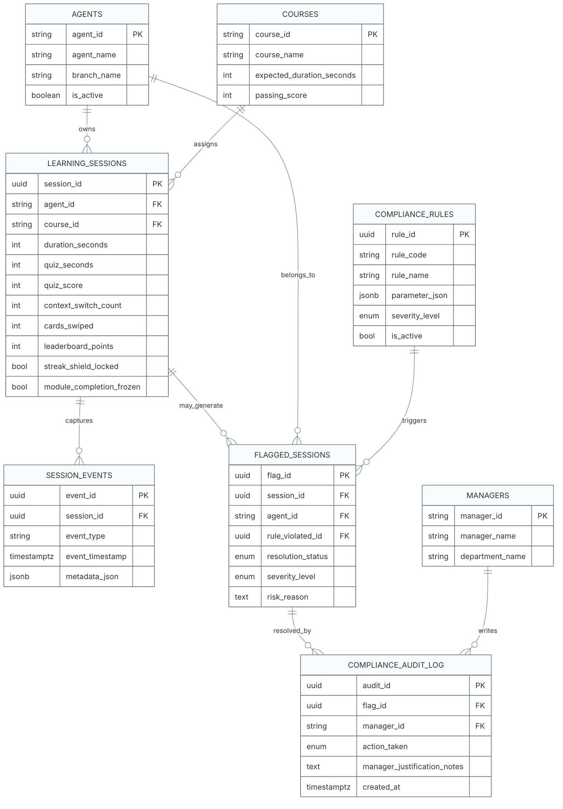

# Anti-Gaming 系統架構圖與風險判斷流程圖

本文件依照目前專案實作重新整理整體系統視圖，內容已對齊 `frontend/`、`backend/`、`schema.sql`、`docker-compose.yml` 與各 service 的實際程式流程。這一版不是只有元件清單，而是把「資料怎麼流動」、「風險怎麼形成」、「主管審核後怎麼回寫」都畫進去，適合直接放進簡報、技術文件或 Demo 附錄。

## 專案掃描摘要

### Frontend
- `frontend/learner.html` + `frontend/learner.js`
  - 建立學習 session
  - 蒐集卡片瀏覽、改答、測驗、頁面焦點、鍵鼠活動
  - 啟用鏡頭 presence 偵測
  - 原生 `FaceDetector` 不可用時 fallback 到 MediaPipe
- `frontend/index.html` + `frontend/app.js`
  - 顯示 Risk Inbox、Flag Detail、Timeline、Audit Trail
  - 查詢 recent sessions、leaderboard、rules
  - 送出主管 resolution

### Backend
- `FastAPI` API 層負責接前端請求
- `SessionService` 管理 session 建立、recent sessions、leaderboard、session detail
- `SessionEventService` 驗證事件、寫入 `session_events`、於 `session_completed` 後觸發規則判斷
- `RuleEvaluationService` 根據 session 摘要與事件 metadata 評估 active rules，並呼叫 ML 輔助評分
- `ML helpers` 提供邏輯回歸形式輔助評分與決策樹 JSON artifact 推論
- `FlagService` 查詢風險事件、組裝明細、寫入主管審核與同步懲罰
- `NotificationService` 在 `voided` / `escalated_to_hr` 後寄出 email

### Database
- PostgreSQL 為核心資料來源
- 主要表：`agents`、`managers`、`courses`、`learning_sessions`、`session_events`、`compliance_rules`、`flagged_sessions`、`compliance_audit_log`
- `compliance_audit_log` 具 append-only trigger，禁止 `UPDATE` / `DELETE` / `TRUNCATE`

### 部署與執行
- 正式環境目前為 `Vercel + Neon PostgreSQL`
- `FastAPI` 在 production 會同時提供 API 與 `frontend/` 靜態頁面
- 本地開發可用 `docker compose up --build` 或分別啟動 backend/frontend
- 前端在本機 `5500/5501` 時呼叫 `http://localhost:8000/api/v1`；在正式環境則走同網域 `/api/v1`

### 風險判斷定位
- 規則式引擎是主體，負責明確門檻、可稽核、高可解釋的異常判斷。
- 機器學習是輔助，包含 `LOGISTIC_REGRESSION_RISK` 與 `DECISION_TREE_RISK`。
- ML 命中時只產生中風險，不直接取代高風險規則，也不直接作為最終懲罰依據。
- 決策樹可用本機 `scikit-learn` 訓練，但 production 只讀 JSON artifact 做輕量推論。

## 圖 1：美化版系統架構總覽

```mermaid
%%{init: {
  "theme": "base",
  "themeVariables": {
    "background": "#ffffff",
    "primaryColor": "#EEF6FF",
    "primaryTextColor": "#0F172A",
    "primaryBorderColor": "#2563EB",
    "lineColor": "#475569",
    "secondaryColor": "#F8FAFC",
    "tertiaryColor": "#FDF2F8",
    "fontFamily": "Inter, Noto Sans TC, Arial"
  },
  "flowchart": {
    "curve": "basis",
    "nodeSpacing": 36,
    "rankSpacing": 44
  }
}}%%
flowchart LR
  learner["Learner Simulator<br/>`frontend/learner.html`<br/><br/>Session 建立 / 作答 / 鏡頭偵測"]
  dashboard["Supervisor Dashboard<br/>`frontend/index.html`<br/><br/>Risk Inbox / Detail / Resolution"]

  subgraph frontend["Frontend Layer"]
    direction TB
    learner
    dashboard
  end

  subgraph api["FastAPI API Layer"]
    direction TB
    health["`GET /health`"]
    sessions["`/api/v1/sessions`<br/>create / recent / leaderboard / detail"]
    events["`POST /api/v1/session-events`"]
    rules["`GET /api/v1/rules`"]
    flags["`GET /api/v1/flags`<br/>`GET /api/v1/flags/{id}`"]
    resolution["`POST /api/v1/flags/{id}/resolution`"]
  end

  subgraph services["Application Services"]
    direction TB
    sessionService["SessionService<br/><span style='font-size:12px'>session lifecycle / leaderboard / detail</span>"]
    eventService["SessionEventService<br/><span style='font-size:12px'>event validation / persistence / completion trigger</span>"]
    ruleEval["RuleEvaluationService<br/><span style='font-size:12px'>rule scan / severity / penalty sync</span>"]
    mlEval["ML Auxiliary Scoring<br/><span style='font-size:12px'>logistic score / decision tree JSON</span>"]
    flagService["FlagService<br/><span style='font-size:12px'>risk inbox / flag detail / resolution / audit</span>"]
    mailService["NotificationService<br/><span style='font-size:12px'>SMTP notification</span>"]
    config["Settings / Config<br/><span style='font-size:12px'>CORS / DB / SMTP / env</span>"]
  end

  subgraph db["PostgreSQL"]
    direction TB
    master["Core Master Data<br/>`agents` / `managers` / `courses`"]
    rulesTable["Rules Store<br/>`compliance_rules`"]
    sessionsTable["Learning Facts<br/>`learning_sessions`"]
    eventsTable["Behavior Evidence<br/>`session_events`"]
    flagsTable["Risk Inbox Source<br/>`flagged_sessions`"]
    auditTable["Immutable Audit Trail<br/>`compliance_audit_log`"]
  end

  learner -->|"建立 session / 發送 evidence"| sessions
  learner -->|"card_swiped / answer_changed / page_dwell_summary / camera_monitor_summary"| events
  learner -->|"同步分數與懲罰狀態"| sessions

  dashboard -->|"查 recent sessions / leaderboard"| sessions
  dashboard -->|"查 rules / flags / detail"| rules
  dashboard --> flags
  dashboard -->|"主管審核"| resolution

  health --> config
  sessions --> sessionService
  events --> eventService
  rules --> sessionService
  rules --> ruleEval
  flags --> flagService
  resolution --> flagService

  sessionService --> master
  sessionService --> sessionsTable
  sessionService --> eventsTable
  sessionService --> flagsTable

  eventService --> sessionsTable
  eventService --> eventsTable
  eventService --> ruleEval
  ruleEval --> mlEval

  ruleEval --> rulesTable
  ruleEval --> sessionsTable
  ruleEval --> eventsTable
  ruleEval --> flagsTable
  mlEval --> rulesTable
  mlEval --> flagsTable

  flagService --> flagsTable
  flagService --> sessionsTable
  flagService --> eventsTable
  flagService --> rulesTable
  flagService --> auditTable
  flagService --> master
  flagService --> mailService

  mailService -. SMTP .-> notify["SMTP Server / Gmail"]

  classDef front fill:#FFF7ED,stroke:#EA580C,stroke-width:2px,color:#431407;
  classDef apiNode fill:#EEF6FF,stroke:#2563EB,stroke-width:2px,color:#0F172A;
  classDef svc fill:#ECFDF3,stroke:#16A34A,stroke-width:2px,color:#14532D;
  classDef data fill:#F5F3FF,stroke:#7C3AED,stroke-width:2px,color:#3B0764;
  classDef audit fill:#FDF2F8,stroke:#DB2777,stroke-width:2px,color:#831843;
  classDef ext fill:#F8FAFC,stroke:#64748B,stroke-width:2px,color:#334155;

  class learner,dashboard front;
  class health,sessions,events,rules,flags,resolution apiNode;
  class sessionService,eventService,ruleEval,mlEval,flagService,mailService,config svc;
  class master,rulesTable,sessionsTable,eventsTable,flagsTable data;
  class auditTable audit;
  class notify ext;
```

## 架構解讀

1. 前端分成兩個角色視角：
   - 學員端負責產生可追溯 evidence
   - 主管端負責查看風險、審核與追蹤
2. `session_events` 是風險判斷的核心證據池，並不是只看最終分數。
3. `session_completed` 是自動判斷的觸發點，會把 session 摘要與 event metadata 一起送進規則引擎。
4. `flagged_sessions` 是風險收件匣來源，同時也承載當前懲罰狀態。
5. `compliance_audit_log` 與 `flagged_sessions` 分工不同：
   - `flagged_sessions` 管現在狀態
   - `compliance_audit_log` 保留永久審核軌跡

## 圖 2：美化版風險判斷與主管處理流程圖

```mermaid
%%{init: {
  "theme": "base",
  "themeVariables": {
    "background": "#ffffff",
    "primaryColor": "#F8FAFC",
    "primaryTextColor": "#0F172A",
    "primaryBorderColor": "#334155",
    "lineColor": "#475569",
    "fontFamily": "Inter, Noto Sans TC, Arial"
  },
  "flowchart": {
    "curve": "basis",
    "nodeSpacing": 34,
    "rankSpacing": 42
  }
}}%%
flowchart TD
  start(["學員開始課程"])
  create["建立 `learning_sessions`"]
  learn["閱讀卡片 / 回答題目 / 鍵鼠互動 / 頁面切換"]
  camera["鏡頭 presence 偵測<br/>FaceDetector 或 MediaPipe fallback"]
  evidence["寫入 `session_events`<br/>含 answer_changed / mouse_activity / keyboard_activity / page_dwell_summary / camera_monitor_summary"]
  quiz["送出 `quiz_submitted`<br/>更新 quiz_seconds / quiz_score"]
  complete["送出 `session_completed`"]
  trigger["SessionEventService 觸發 RuleEvaluationService"]

  metrics["彙整 evidence metrics<br/>wrong_count / answer_changes / focus_ratio / face_absence / multiple_faces"]
  active{"讀取 active rules"}

  r1["IMPOSSIBLE_SPEED"]
  r2["BLIND_GUESSING"]
  r3["REPEATED_ANSWER_CHANGES"]
  rMl1["LOGISTIC_REGRESSION_RISK<br/>中風險輔助"]
  rMl2["DECISION_TREE_RISK<br/>中風險輔助"]
  r4["LOW_INPUT_ACTIVITY"]
  r5["LOW_PAGE_FOCUS_RATIO"]
  r6["LONG_FACE_ABSENCE"]
  r7["MULTIPLE_FACES_PRESENT"]

  hit{"是否命中任一規則"}
  normal["不建立 flag<br/>保留正常積分與完成資格"]
  createFlag["寫入 `flagged_sessions`<br/>附帶 severity / risk_reason / penalty state"]

  severity{"風險等級"}
  low["Low<br/>保留積分與模組資格<br/>主管可追蹤"]
  medium["Medium<br/>排行榜積分與週獎勵歸零"]
  high["High<br/>積分歸零 + Streak Shield 鎖定 + 模組完成凍結"]

  inbox["Dashboard Risk Inbox"]
  detail["Flag Detail / Timeline / Audit Trail"]
  decision{"主管審核"}

  approved["`approved`<br/>誤判或可接受"]
  voided["`voided`<br/>作廢重修"]
  escalated["`escalated_to_hr`<br/>通報 HR"]

  audit["寫入 `compliance_audit_log`"]
  resync["重新同步同 session 全部 flag 的懲罰狀態"]
  notify["NotificationService<br/>依動作寄送 email"]
  hasRisk{"是否仍有未核准風險"}
  restore["恢復 session 積分與資格"]
  keep["維持懲罰狀態"]
  endNode(["狀態回寫 Dashboard / Learner"])

  start --> create --> learn --> camera --> evidence --> quiz --> complete --> trigger --> metrics --> active
  active --> r1
  active --> r2
  active --> r3
  active --> rMl1
  active --> rMl2
  active --> r4
  active --> r5
  active --> r6
  active --> r7

  r1 --> hit
  r2 --> hit
  r3 --> hit
  rMl1 --> hit
  rMl2 --> hit
  r4 --> hit
  r5 --> hit
  r6 --> hit
  r7 --> hit

  hit -->|"否"| normal --> endNode
  hit -->|"是"| createFlag --> severity

  severity -->|"low"| low --> inbox
  severity -->|"medium"| medium --> inbox
  severity -->|"high"| high --> inbox

  inbox --> detail --> decision
  decision --> approved --> audit
  decision --> voided --> audit
  decision --> escalated --> audit

  voided --> notify
  escalated --> notify

  audit --> resync --> hasRisk
  notify --> hasRisk
  hasRisk -->|"否"| restore --> endNode
  hasRisk -->|"是"| keep --> endNode

  classDef startEnd fill:#0F172A,stroke:#0F172A,stroke-width:2px,color:#FFFFFF;
  classDef step fill:#EEF6FF,stroke:#2563EB,stroke-width:2px,color:#0F172A;
  classDef detect fill:#F5F3FF,stroke:#7C3AED,stroke-width:2px,color:#4C1D95;
  classDef decision fill:#FFF7ED,stroke:#EA580C,stroke-width:2px,color:#7C2D12;
  classDef lowClass fill:#ECFDF3,stroke:#16A34A,stroke-width:2px,color:#14532D;
  classDef medClass fill:#FEF9C3,stroke:#CA8A04,stroke-width:2px,color:#713F12;
  classDef highClass fill:#FFF1F2,stroke:#E11D48,stroke-width:2px,color:#881337;
  classDef auditClass fill:#FDF2F8,stroke:#DB2777,stroke-width:2px,color:#831843;

  class start,endNode startEnd;
  class create,learn,camera,evidence,quiz,complete,trigger,metrics,inbox,detail,resync,restore,keep,normal,createFlag,notify step;
  class r1,r2,r3,r4,r5,r6,r7,active detect;
  class hit,severity,decision,hasRisk decision;
  class low lowClass;
  class medium medClass;
  class high highClass;
  class approved,voided,escalated,audit auditClass;
```

## 流程重點判讀

1. 這個系統不是「測驗交卷就判定」，而是把整個學習與作答過程當成證據鏈。
2. 風險判斷不只看單一欄位，而是混合：
   - session 摘要
   - 測驗結果
   - 行為事件
   - 鏡頭統計
3. `medium` 與 `high` 都會讓排行榜積分歸零，但只有 `high` 會鎖定 `streak_shield_locked` 與 `module_completion_frozen`。
4. 主管審核不是覆蓋歷史，而是：
   - 更新 `flagged_sessions` 當前狀態
   - 另外 append 到 `compliance_audit_log`
5. `approved` 後若同一個 session 沒有其他未核准 flag，才會恢復積分與資格。

## 圖 3：資料關聯與證據沉澱視圖



## 圖例

| 顏色 | 說明 |
| --- | --- |
| 橘色 | 前端角色或互動入口 |
| 藍色 | API / 主流程節點 |
| 綠色 | 後端服務 |
| 紫色 | 規則、證據或資料判斷節點 |
| 黃色 | 中度風險 |
| 粉紅/紅色 | 高風險、審核、不可變稽核 |

## 適合簡報的口語版總結

這個系統的核心不是單純抓作弊，而是把學員從進入課程、翻卡、作答、切頁、低互動、鏡頭 presence，到主管審核與後續通知，全部串成一條可追溯的合規證據鏈。前端負責產生證據，後端規則引擎負責判讀風險，資料庫負責保存當前狀態與不可變 audit trail，最後由主管 dashboard 做最終決策。
